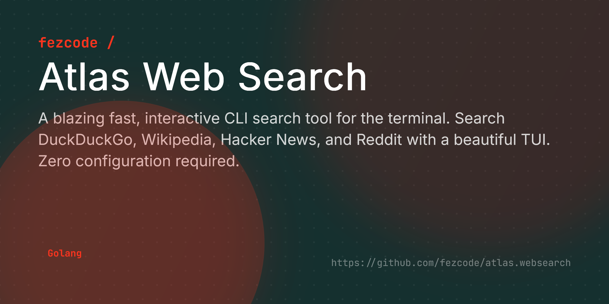

# Atlas Web Search



**atlas.websearch** is a fast, interactive terminal user interface (TUI) for web searching. It aggregates results from multiple zero-config sources and presents them in a clean, navigable interface.


## ✨ Features

- 🚀 **Zero Config:** No API keys required for core engines (DDG, Wiki, HN, Reddit).
- 🎨 **Beautiful TUI:** Built with `bubbletea` and `lipgloss` for a modern terminal experience.
- 🔍 **Multiple Engines:** Switch between general search, tech news, or encyclopedic summaries.
- 🌐 **Direct Access:** Open results instantly in your default browser.
- 📦 **Cross-Platform:** Binaries available for Windows, Linux, and macOS (x86, x64, ARM).

## 🚀 Installation

### From Source
```bash
git clone https://github.com/fezcode/atlas.websearch
cd atlas.websearch
go build -o atlas .
```

## ⌨️ Usage

Simply run the binary with your search query in quotes:

```bash
# General search (DuckDuckGo)
atlas "Golang concurrency"

# Search specific engine
atlas -e wiki "Quantum Computing"
atlas -e hn "Apple Vision Pro"
atlas -e reddit "Self Hosted"

# Use explicit query flag
atlas -q "SpaceX" -e ddg
```

### Options
- `-e`: Search engine (`ddg`, `wiki`, `hn`, `reddit`). Default: `ddg`.
- `-l`: Result limit. Default: `10`.
- `-q`: Explicit query string.

## 🕹️ Controls

| Key | Action |
|-----|--------|
| `↑/↓` or `k/j` | Navigate results |
| `Enter` | Open selected result in browser |
| `q` or `Esc` | Quit Atlas |
| `Ctrl+C` | Force quit |

## 🛠️ Engines

- **DuckDuckGo:** General web results and summaries.
- **Wikipedia:** Encyclopedic abstracts and direct article links.
- **Hacker News:** Top tech stories and discussions via Algolia.
- **Reddit:** Thread search across all subreddits.

## 🏗️ Building for all platforms

The project includes a Go-based build script to generate binaries for all platforms:

```bash
go run scripts/build.go
```
Binaries will be placed in the `build/` directory.

## 📄 License
MIT License - see [LICENSE](LICENSE) for details.
