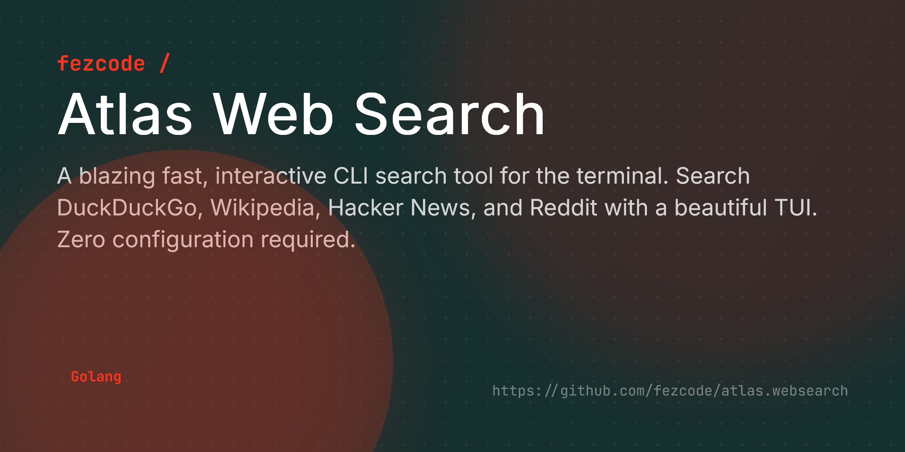

# Atlas Web Search



**atlas.websearch** is a fast, interactive terminal user interface (TUI) for web searching. It aggregates results from multiple zero-config sources and presents them on a phosphor-CRT console styled interface inspired by 1970s engineering workstations.


## ✨ Features

- 📡 **Zero Config:** No API keys required — DuckDuckGo, Wikipedia, Hacker News, and Reddit work out of the box.
- 🔀 **Multi-Engine Fan-out:** Query every engine in parallel with `-e all`; results are merged round-robin so no engine dominates the top.
- ⚡ **Per-engine Telemetry:** Live pills for engine state, latency class, and hit counts.
- 🔍 **In-App Search:** Type `/` to re-enter the console and issue a new query without restarting.
- 🔁 **Cycle & Re-run:** Press `e` to swap engines and `r` to re-run without re-typing.
- 🌐 **Direct Access:** Enter opens the highlighted result in your default browser.
- 📦 **Cross-Platform:** Binaries available for Windows, Linux, and macOS (AMD64, ARM64).

## 🚀 Installation

### From Source
```bash
git clone https://github.com/fezcode/atlas.websearch
cd atlas.websearch
go build -o atlas.websearch .
```

## ⌨️ Usage

```bash
# General search (DuckDuckGo, interactive UI)
atlas.websearch "Golang concurrency"

# Specific engine
atlas.websearch -e wiki "Quantum Computing"
atlas.websearch -e hn "Apple Vision Pro"
atlas.websearch -e reddit "Self Hosted"

# Fan out to every engine at once
atlas.websearch -e all "Rust vs Go"

# Bigger result set
atlas.websearch -e ddg -l 25 "SpaceX"

# Launch with no query and search from inside the TUI
atlas.websearch
```

### Options
- `-q`: Explicit query string (alternative to positional args).
- `-e`: Engine: `ddg`, `wiki`, `hn`, `reddit`, or `all`. Default: `ddg`.
- `-l`: Per-engine result limit. Default: `10`.

## 🕹️ Controls

| Key | Action |
|-----|--------|
| `↑/↓` or `k/j` | Navigate results |
| `g` / `G` | Jump to first / last result |
| `Enter` or `o` | Open selected result in browser |
| `/` | Focus console, enter a new query |
| `e` / `E` | Cycle engine forward / backward (re-runs the query) |
| `r` | Re-run the current query |
| `q` or `Esc` | Quit |
| `Ctrl+C` | Force quit |

## 🛠️ Engines

| Code | Source | Notes |
|------|--------|-------|
| `ddg` | DuckDuckGo | HTML lite endpoint — general web results. |
| `wiki` | Wikipedia | OpenSearch API — encyclopedic abstracts. |
| `hn` | Hacker News | Algolia API — stories with points and comments. |
| `reddit` | Reddit | Public search JSON — threads across all subs. |
| `all` | fan-out | All four in parallel, merged round-robin. |

## 🏗️ Building for all platforms

The project uses **gobake** to generate binaries for all supported platforms:

```bash
gobake build
```
Binaries are placed in the `build/` directory.

## 📄 License
MIT License - see [LICENSE](LICENSE) for details.
